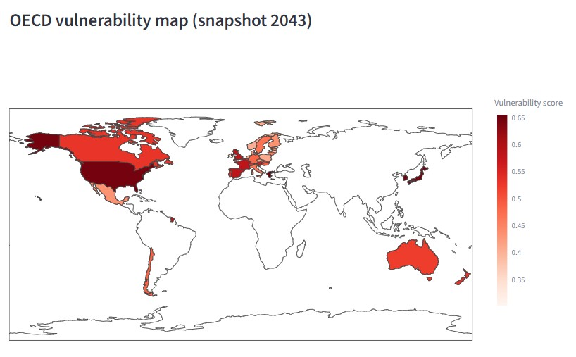
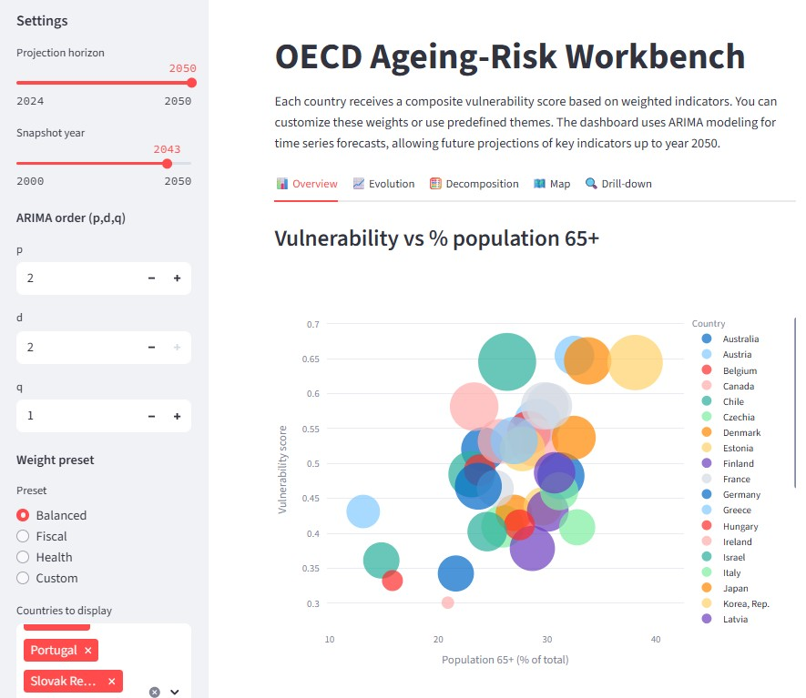
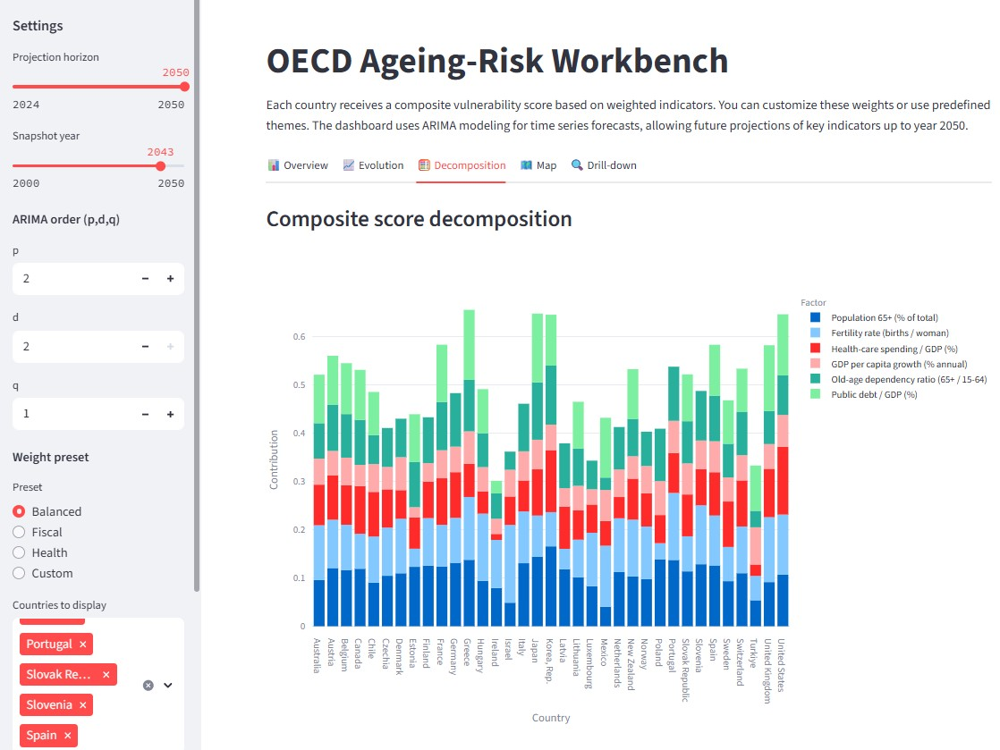
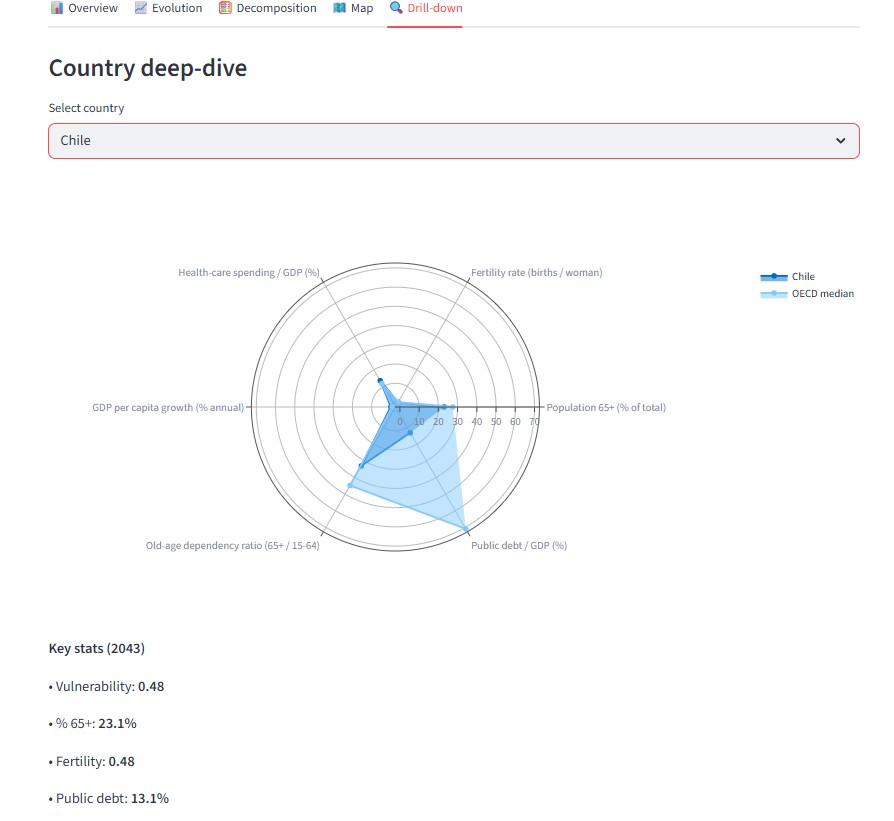
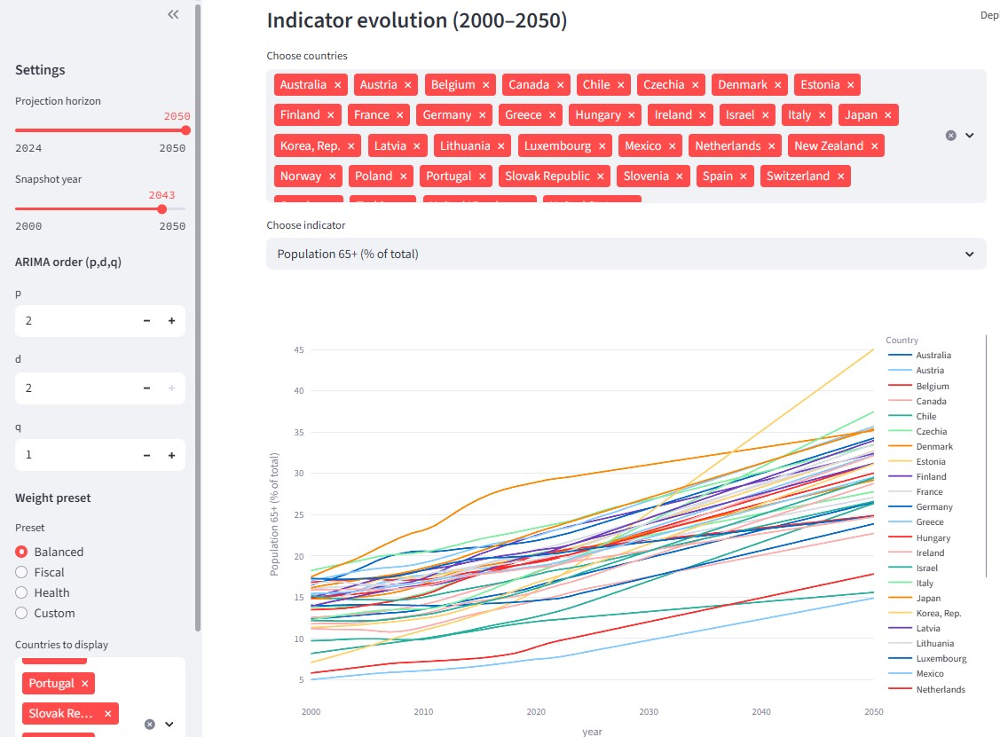

# 🧓 OECD Ageing‑Risk Workbench

An interactive Streamlit dashboard to visualize, compare, and forecast aging-related fiscal and demographic risks across OECD countries using World Bank data and ARIMA-based projections.

This tool is ideal for researchers, policy analysts, or anyone interested in understanding how population aging and fiscal indicators affect future vulnerability among advanced economies.

---

## 🔍 What Does the Dashboard Show?

The app has five main screens — each answering a unique question about long-term demographic risk:

---

### 🗺️ **Map – OECD Vulnerability Overview**

Shows the composite vulnerability score for all OECD countries on a world map. Darker shades indicate higher vulnerability based on ageing, healthcare, fiscal pressure, and economic trends.

📍 Helps answer:  
> “Which countries face the greatest risk in [snapshot year]?”



---

### 📊 **Overview – Vulnerability vs Aging**

Interactive bubble chart showing how countries score on:
- % of population aged 65+
- Composite risk score
- Healthcare spending (bubble size)

📍 Helps answer:  
> “Which countries are both ageing and vulnerable?”



---

### 🧮 **Decomposition – What Drives the Risk?**

Stacked bar chart decomposing each country’s vulnerability into individual factor contributions — e.g., fertility, public debt, health spending, etc.

📍 Helps answer:  
> “What’s driving the vulnerability in each country?”



---

### 🔍 **Drill-down – Country Deep-Dive**

View a radar chart comparing one country’s scaled indicator scores against the OECD median.

📍 Helps answer:  
> “How does one country compare to the OECD average?”



---

### 📈 **Evolution – Indicator Trends to 2050**

Shows time series trends (historic + forecasted) for any indicator across selected countries using ARIMA forecasting.

📍 Helps answer:  
> “How are these trends projected to change?”



---

## 💡 Customization Options

- 📅 Choose projection horizon and snapshot year (up to 2050)
- 🔢 Set ARIMA (p,d,q) parameters for forecasts
- ⚖️ Adjust indicator weights or use presets (Balanced, Fiscal, Health)
- 🌍 Filter countries for detailed analysis

---

## ✨ Features

- 📊 **Composite Vulnerability Score** based on:
  - Population 65+ (%)
  - Fertility Rate
  - Health Expenditure (% of GDP)
  - GDP per Capita Growth
  - Old‑Age Dependency Ratio
  - Public Debt (% of GDP) — from **World Bank**

- 🔮 **ARIMA Forecasting** to project trends up to 2050

- 🎛️ Customizable weight presets:
  - Balanced, Fiscal, Health, or Custom Weights

- 📈 Country-specific time series & radar plots

- 🌍 Interactive world map of OECD countries

- 📥 Download buttons for snapshot & full panel CSVs

---

## 🛠️ Tech Stack

- **Language**: Python 3
- **Frontend**: [Streamlit](https://streamlit.io/)
- **Data Sources**: [World Bank API](https://data.worldbank.org/)
- **Forecasting**: ARIMA models (`statsmodels`)
- **Visualization**: Plotly

---

## 🚀 Live Demo

👉 [View Deployed App on Render](https://your-app-url.onrender.com)

---

## 📦 Installation

1. **Clone the repository:**

```bash
git clone https://github.com/alvesmh/oecd-aging-workbench.git
cd oecd-aging-workbench
```

(Optional) Create a virtual environment:
```bash
python -m venv venv
source venv/bin/activate  # On Windows: venv\Scripts\activate
```

Install dependencies:

```bash
pip install -r requirements.txt
```

Run the app:
```bash
streamlit run dash4.py
```

🧮 Methodology
Each country receives a composite vulnerability score based on weighted indicators. You can customize these weights or use predefined themes. The dashboard uses ARIMA modeling for time series forecasts, allowing future projections of key indicators up to year 2050.

📊 Example Use Cases
* Comparative policy analysis of aging risks

* Long-term fiscal vulnerability forecasting

* Demographic sustainability visualization

📁 Project Structure
```bash
📦 oecd-ageing-workbench
├── oecd_aging_dashboard.py # Main Streamlit app
├── requirements.txt        # Dependencies
├── setup.sh                # Render deployment config
└── README.md               # Project documentation

🙌 Acknowledgements
World Bank Open Data

Streamlit for rapid app development

Plotly for powerful visualizations

OECD country codes and demographic concepts

📄 License
This project is licensed under the MIT License.